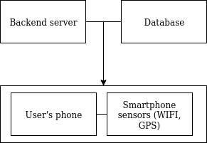
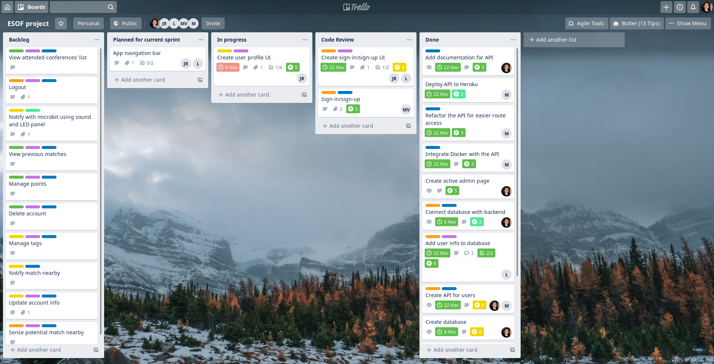

# openCX-*netinder* Development Report

Welcome to the documentation pages of the *NetTinder* module of **openCX**!

You can find here detailed information about the (sub)product, hereby mentioned as module, from a high-level vision to low-level implementation decisions, a kind of Software Development Report (see [template](https://github.com/softeng-feup/open-cx/blob/master/docs/templates/Development-Report.md)), organized by discipline (as of RUP): 

* Business modeling 
  * [Product Vision](#Product-Vision)
  * [Elevator Pitch](#Elevator-Pitch)
* Requirements
  * [Use Case Diagram](#Use-case-diagram)
  * [User stories](#User-stories)
  * [Domain model](#Domain-model)
* Architecture and Design
  * [Logical architecture](#Logical-architecture)
  * [Physical architecture](#Physical-architecture)
  * [Prototype]
* [Implementation]
* [Test](#Test)
* [Configuration and change management]
* [Project managememy]

So far, contribution the initial team, but we hope to open them to the community, in all areas and topics: requirements, technologies, development, experimentation...

Please contact us!

Thank you!

The developers: *Carlos Duarte*, *Joaquim Rodrigues*, *Leonardo Moura*, *Maria Viana*, 
and *Mark Meehan*.

---

## Product Vision
For conference participants who want to take their networking experience to the next level, NeTinder is an app that matches them by their interests, 
maximizing the time each one spends learning more about their favourite areas.

---
## Elevator Pitch
Have you ever been to a conference and thought to yourself that many of the companies or participants that you talk to have very different interests than you do? Do you feel that you 
end up wasting your time talking to people you don't want to instead of connecting to others that share your passions and have common goals to yours?
With NeTinder, we are fixing this for good.
By using our app, you can select the topics aborded in a conference that are of most interest to you, and when you are nearby someone that is a 
good match, your phone will bleep and display a number. That number will also be displayed on the match's phone, helping you find each other in such crowded places.
And the more you network with others, the more prizes you win!

---
## Requirements
### Functional requirements
- The system shall be based on two main components: a mobile app and a microbit.
- The app shall allow the user to pick his main areas of interest (that will be debated in the conference).
- The app shall feature a login system so that a user can access his personal information.
- The app must let users claim the prizes they have won, and check their progress in getting them.
- The microbit shall detect when a match is nearby the user via bluetooth.
- The microbit shall emit a noise and display a number that will allow easy idenfitication by the other participant that he was matched with.
- The app and the microbit shall communicate with each other in order to sync information.

### Non-functional requirements
- Bluetooth communications should be smooth and stable

### Use case diagram 

#### Pick tags
* **Actor** - A person attending the conference

* **Description** - In order for a participant to be matched with others, their favourite topics need to be explicited (which assume the form of tags). When the tags are selected, more appropriate matches will be found and the user's interaction will be much more valuable.

* **Preconditions and Postconditions** - The user needs to be signed up to the app and be authenticated. After picking the tags, these should be visible in the user's profile. The system should have one more tag in the list of selected tags.

* **Normal Flow**

    1 - User thinks of a tag that is of his interest

    2 - User checks if the tag is present in the list of available tags. If the tag exists, he selects it
    
    3 - The system rememebers the tag as selected by the user
    
    4 - The system now uses the tag to match the user with others that have picked this same tag

* **Alternative Flows and Exceptions** - It may happen that the tag a user wants to select doesn't exist. In this case, he will be unable to select it and the system will send an error message, as tags are assign per event (it doesn't make sense to match tags that have nothing to do with the event's context).

#### View list of matches

* **Actor** - A person attending the conference.

* **Description** - In order for a participant to know to whom he was matched, he needs to have access to a page that shows him everyone who picked the same tags as him.

* **Preconditions and Postconditions** - The user needs to be signed up to the app and be authenticated. After picking the tags, his matches should be visible in a page made for that. 

* **Normal Flow**

    1 - User inserts tags.

    2 - The system calculates the matches based on the tags.

    3 - The system shows the new matches and saves them.

* **Alternative Flows and Exceptions** - It may happen that the user doesn't have any matches. In this case, no new matched would be shown in the page.

#### Check/manage points and available discounts

* **Actor** - A person attending the conference.

* **Description** - The more active a participant is in our app, the more points he earns. For this, users will be able to check how many points thay have in ther personal page. These points can be traded in the conference sponsor's stand for discounts. 

* **Preconditions and Postconditions** - The user needs to be signed up to the app and be authenticated. After picking the tags and being matched, he will start to earn points.

* **Normal Flow**

    1 - User is matched.

    2 - User interacts with his matches.

    3 - User earns points.

    4 - User can trade points for discounts.

* **Alternative Flows and Exceptions** - It may happen that the user doesn't have any points. In this case, he won't be able to trade his points for anything.

### User stories
We have made our Trello board public so that you can check the user stories and acceptance test scenarios more easily. You can also see how the project is progressing by checking the board, as you'll be able to see when new features are finished, awaiting code review, added to the backlog... (https://trello.com/b/8qWwiWTX/netinder).

The board consists of user stories. Each one of them is assigned a priority as a label, and these priorities can assume one of four states: Critical, urgent, moderately important and nice to have. 

We are also identifying each user story with a label that identifies it as part of the frontend, backend or microbit portion of our software.

In the description of each card you can take a look at the acceptance tests and use-case scenarios. Each card is also assigned to one (seldom multiple) of the team members.
Our kanban board is made up of several lists: 
- Backlog - requirements that are not yet specified as user stories
- Todo - user stories awaiting a developer to pick them
- In progress - user stories currently being developed
- Review in progress - user story that has been developed but is awaiting review (by means of approving a pull request)
- Reviewer approved - user story that has been approved by more than one member of the development team
- Done - fully implemented requirements
Each one of the cards in our Trello board has a mockup as an attatchment. Be sure to check it out!

We are also assigning points to each of our stories as a way to measure the effort requires to implement each one of them. We'll be using the following set of Fibonacci numbers while sizing a user story, from minimum to max effort: 1, 2, 3, 5, 8, 13, 21. 

### Domain model

---

## Architecture and Design
Our project is composed by three main modules:
* Mobile application
* Server
* Database

The **mobile app** is being developed in Flutter, and it currently targets Android devices. 

The **server** is written in NodeJS, with the core machine-to-machine communications being handled by Express, a web application framework designed for building web applications and APIs. We are connecting the backend to the database with Mongoose, which is an Object Data Modeling (ODM) library for MongoDB and Node.js - it manages relationships between data, provides schema validation, and is used to translate between objects in code and the representation of those objects in MongoDB.

Finally, we also ship a MongoDB **datbase** to sync the user's and events' information with every device participating in the conference. We opted for MongoDB, which is a document database that provides us with great flexibility and scalability.

We are implementing a Model-View-Controller (MVC) philosophy into our product, where:
- The **model** holds the application's data structures, and is independente of the user interface. Directly manages the data, logic and rules of the application;
- The **view** is the visual representation of the information held in the model;
- The **controller** converts input into commands to be provided either to the model or to the view.

We faced some problems during the intial architecture conception, mainly concerning the database and API connection. 
1. We had difficulties trying to connect our Flutter frontend app with the server. What was happening was that we had our backend running locally on localhost, and we weren't able to make requests to the API inside the frontend, because the mobile phone and the PC running the backend had one different localhost each. As such, we had to wait for the backend to be deployed to be able to communicate between both. 
2. Creating the database was also a challenge. We are using MongoDB, and because we had never worked with a NoSQL database before, we had some doubts about how to correctly display and distribute the data across multiple schemas. With some more experience and hard work, we were able to overcome this issue.

### Logical architecture

We are using the MCV pattern to better architecture the logic of our application, as we have explicited above.

- The **model** is made up of the database, server and flutter code - it's the core of the application;
- The **view** is made up of the pages of the mobile application, and lets the user visualize the data;
- The **controller** processes input from the user, consults the model and updates the view accordingly.

### Physical architecture

Our app uses the following physical components:

- User's smartphone, with its array of sensors (containing at least WIFI and GPS sensors);
- A database to hold the data of the users, conferences, 

### Prototype
To help on validating all the architectural, design and technological decisions made, we usually implement a vertical prototype, a thin vertical slice of the s9ystem.

In this subsection please describe in more detail which, and how, user(s) story(ies) were implemented.

---

## Implementation
#### Iteration 1
In our first iteration, we stumbled across several problems.

Firstly, we didn't find a stable and easy enough way to communicate with the microbit through bluetooth. We managed to pair it with a mobile phone, and signal when it is and isn't connected (by playing some sounds when it is paired and unpaired).

To use the microbit as a bluetooth communications sender/receiver, we found out - after a lot of research - that we could not use microbit's library of bluetooth functions to do everything we needed: even sending a simple JSON file is not feasible due to architectural constraints. As such, we were left with two options:
* **Use micropython to program the microbit**. This was impossible because the amount of RAM needed by micropython to run on the microbit makes it impossible for bluetooth communitations run at the same time. The microbit should definitely not be this micro when RAM size is concerned.
* **Use C++ library provived by the University of Lancaster**. We discovered a rather obscure C++ library that makes it possible to program bluetooth interations on the microbit. Unfortunately (again), the documentation is rather poor, and from what we tested, it would demand a very considerable amount of time to properly understand it and implement the code.

We also came to the conclusion that the usage of the microbit would be rather redundant. We were planning on using it to signal when a match is nearby a user, and to display a code on its screen so that identification of both participants is easier. Considering the amount of work that the above solutions would take to make bluetooth communications possible, and considering that this functionality can be perfectly well implemented on our mobile app, we have decided to not use microbit in our project. The amount of time needed to accomplish the task of having real time bluetooth communications happening on the microbit was not worth it, considering that the same gains can be achieved with a lot less work using the mobile app and Android's already-integrated bluetooth functionality.

Regarding the frontend of our mobile app, we have created the sign-in/sign-up menu on the mobile app. We have also created a script that stores users' information as a JSON file.

This iteratoin was very important for us to test the technologies we proposed ourselved to use, and to cross out some of the initial planned ideas. We believe that the decisions explicited above will make our product a stronger and more laser-focused one. Now, we have a much clearer vision of what we want to do, and it all begins with the following iteration.

#### Iteration 2
IMPORTANT: The following updates have not yet been merged to the master branch. You can check the existing branches in the GitHub repository to view the code we are developing. We believe that code should only be pushed to master when it is fully baked, and this is the reason why it's maturing a bit more in those branches.

This is our Trello board right at the end of the second iteration. 

We have now successfully created a database to store our users' and events' information; created a backend REST API to handle POST and GET requests to the database; and integrated both the backend and the database by using the mongoose framework. 

Whilst the "Create API for users" and "Sign-in/sign-up" are still in the "In progress" list, they are mostly finished and just being a little bit more polished. Also, we still have some pull requests awaiting code review, but we have tested the code and it works and is integrated beautifully. The code reviews will be done very shortly.

You are also able to see that we have already planned our next sprint. We will be tackling the following topics:
* creation of a "sign-in/sign-up" menu for the mobile app;
* addition pf a global navigation bar for the mobile app;
* creation of a menu to check previous conferences attended by the user;
* integrating each of the previous topics with the backend;
* build an active admin page to handle the dabatase.

We would like to talk a bit more about the last topic in the previous list. As a team, we feel like we have designed a great backend application that is easily scalable and flexible enough to handle next year's conference @ FEUP perfectly well. As such, and after talking about it with professor Ademar, we will also be focusing our next sprint on creating an active admin page that will let administrators add, remove and execute other operations in the database. We will be doing this because we want our backend to be the one picked by the courses' teachers to serve as the skeleton to every other open-cx module. 

It's a challenge we are very excited to take on, and we will be hard at work this week to make it a reality as soon as possible!

#### Iteration 3

During this iteration, our work on the backend was shared with every other group in the main open-cx repository. For that reason, our main focus was to continue the development of our API and database, so that all the groups would have something to start with. Specifically, we added some new models, requested by other groups, to our databse, as well as some new endpoints for fetching and adding the respective information. A general refactor of our whole backend solution was also made. Besides that, we have successfully deployed our backend to Heroku, so from now one every ESOF student can interact with the backend and make requests at will. We have also finished integrating the backend with Docker - the version currently available to every student is running on a Docker container.
There are some things that we are working on, but are not yet finished:
- We are implementing an authentication mecanism into the API, so that only users who are registered in the open-cx applications can access the data (and only data that they have permissions to access to).
- Another feature we are dabbling with is the ability to run a MongoDB instance locally. This would speed up development for every student.
- We are also in the middle of merging our documentation with the **openapiswagger** framework. Good documentation is an essential part of every software project, and we know that. This will help every open-cx developer understanding better how our systems work.
- We are also thinking of switching the active-admin interface to another one, because the current one doesn't support adding objects in the web interface. We are still evaluating this matter, but expect to make a decision in the next couple of days.

#### Iteration 4

In this iteration, we have dedicated our time to add multiple new features to the app. 
- An authentication system was implemented to the backend of the app. Now, users can register into the app and have their information saved on the database. The server checks if the information a user has inserted is valid, and allows them to login. When a user logs in, he/she gets a JWT (JSON Web Token) which will allow them to access private routes of the backend interface. For example:
    - Imagine the user wants to view his/hers private information. Only him/her should be able to do so. Because the user gets a JWT when he logs in, he can show it to the backend when he wants to view the private information, and the backend will make sure that JWT is valid (and is owned by that user). If this happend, then the user has full access to his/her information. Otherwise, access is denied.
We have also integrated the login page with the authentication funcionality, so it is fully operational.
In addition, we have created pages on the app that allow users to view information on the conferences they've been to, as well as check their matches and the tags they have selected.
New models have been added to the backend, as well as routes to access them. 
Overall, this phase was all about implementing missing functionality and glueing it all together.

We would like to note that our production rate has slowed down a bit because of how heavy Android Studio (and the Flutter integration) is on our computers. It has happened multiple times that the PCs freeze and need a reboot, which obviously causes some of the work done to be lost.

---
## Test

There are several ways of documenting testing activities, and quality assurance in general, being the most common: a strategy, a plan, test case specifications, and test checklists.

In this section it is only expected to include the following:
* test plan describing the list of features to be tested and the testing methods and tools;
* test case specifications to verify the functionalities, using unit tests and acceptance tests.
 
A good practice is to simplify this, avoiding repetitions, and automating the testing actions as much as possible.

---
## Configuration and change management

Configuration and change management are key activities to control change to, and maintain the integrity of, a project’s artifacts (code, models, documents).

For the purpose of ESOF, we will use a very simple approach, just to manage feature requests, bug fixes, and improvements, using GitHub issues and following the [GitHub flow](https://guides.github.com/introduction/flow/).

---

## Project management
We are using a Trello board to manage user stories - and set their priorities, categories, use cases, assignee, due date and current status.
Our kanban board is public for viewing. You can consult it using the following link: https://trello.com/b/8qWwiWTX/netinder.